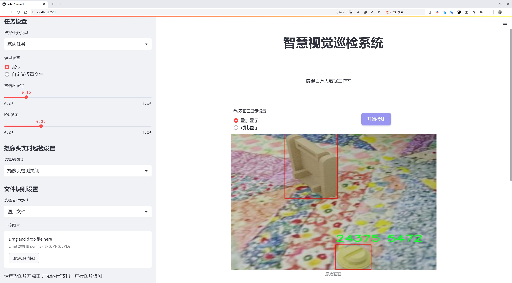
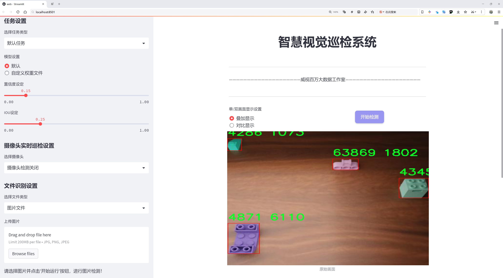
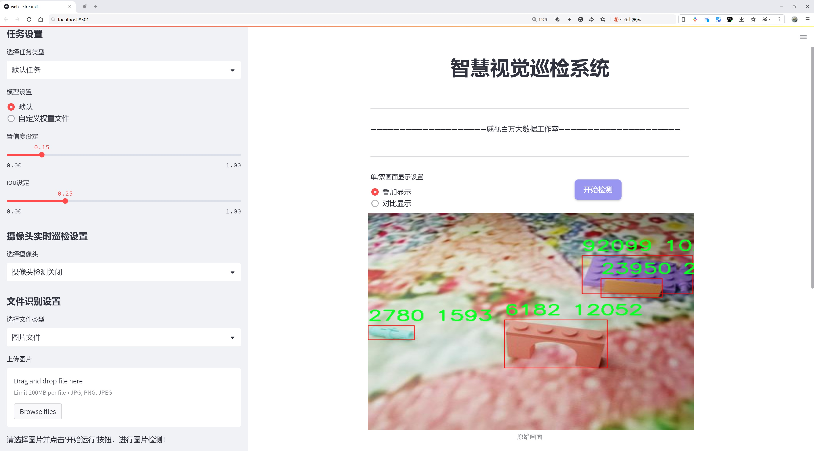
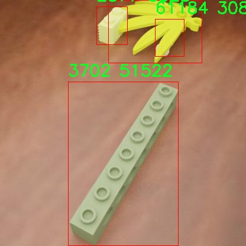
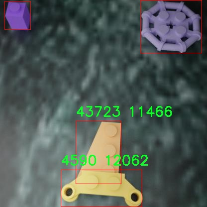
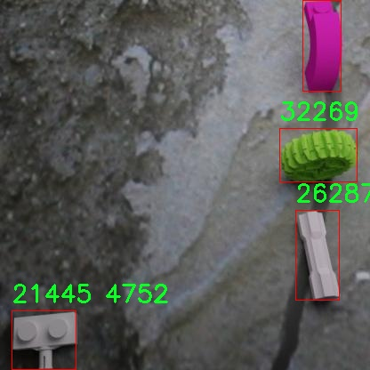
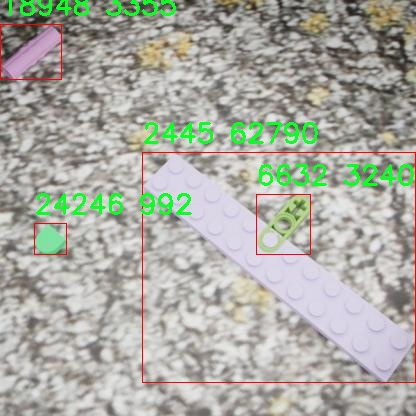
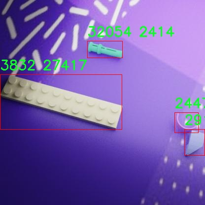

# Lego积木检测系统源码分享
 # [一条龙教学YOLOV8标注好的数据集一键训练_70+全套改进创新点发刊_Web前端展示]

### 1.研究背景与意义

项目参考[AAAI Association for the Advancement of Artificial Intelligence](https://gitee.com/qunmasj/projects)

### 研究背景与意义

随着人工智能技术的迅猛发展，计算机视觉领域的研究不断深入，尤其是在物体检测和识别方面，深度学习方法已成为主流。YOLO（You Only Look Once）系列模型以其高效的实时检测能力和优越的精度，广泛应用于各种场景。然而，现有的YOLOv8模型在处理复杂背景、遮挡物体及多类别物体检测时，仍存在一定的局限性。针对这一问题，基于改进YOLOv8的Lego积木检测系统的研究应运而生，旨在提升Lego积木的检测精度和速度，满足实际应用需求。

Lego积木作为一种广受欢迎的玩具，不仅在儿童教育中扮演着重要角色，也在成人创意设计、工程建模等领域得到了广泛应用。随着Lego积木种类的不断增加，市场上已存在574个类别、近10000张图像的数据集，为研究提供了丰富的素材。这一数据集的多样性和复杂性，既为模型的训练提供了良好的基础，也对模型的检测能力提出了更高的要求。因此，构建一个高效的Lego积木检测系统，不仅能够提升用户体验，还能为相关领域的研究提供支持。

在研究过程中，我们将对YOLOv8模型进行改进，重点关注以下几个方面：首先，针对Lego积木的特征进行深入分析，优化模型的特征提取层，以提高对小物体和复杂背景的识别能力；其次，结合数据增强技术，提升模型的泛化能力，确保其在不同环境下的稳定性；最后，通过引入多尺度检测机制，增强模型对不同尺寸Lego积木的检测能力。这些改进将使得检测系统在实际应用中表现得更加出色。

此外，Lego积木检测系统的研究不仅具有学术价值，也具有重要的社会意义。通过提高Lego积木的检测效率，可以促进教育行业的数字化转型，帮助教师和学生更好地利用这一工具进行创意设计和工程实践。同时，该系统的成功应用也将为其他物体检测领域提供借鉴，推动计算机视觉技术的进一步发展。

综上所述，基于改进YOLOv8的Lego积木检测系统的研究，既是对现有技术的挑战与突破，也是对Lego积木应用领域的深入探索。通过这一研究，我们希望能够为物体检测技术的发展贡献一份力量，同时为Lego积木的广泛应用提供技术支持。

### 2.图片演示







##### 注意：由于此博客编辑较早，上面“2.图片演示”和“3.视频演示”展示的系统图片或者视频可能为老版本，新版本在老版本的基础上升级如下：（实际效果以升级的新版本为准）

  （1）适配了YOLOV8的“目标检测”模型和“实例分割”模型，通过加载相应的权重（.pt）文件即可自适应加载模型。

  （2）支持“图片识别”、“视频识别”、“摄像头实时识别”三种识别模式。

  （3）支持“图片识别”、“视频识别”、“摄像头实时识别”三种识别结果保存导出，解决手动导出（容易卡顿出现爆内存）存在的问题，识别完自动保存结果并导出到。

  （4）支持Web前端系统中的标题、背景图等自定义修改，后面提供修改教程。

  另外本项目提供训练的数据集和训练教程,暂不提供权重文件（best.pt）,需要您按照教程进行训练后实现图片演示和Web前端界面演示的效果。

### 3.视频演示

[3.1 视频演示](https://www.bilibili.com/video/BV1cPsce4EdZ/)

### 4.数据集信息展示

数据集信息展示

本数据集专为改进YOLOv8的Lego积木检测系统而设计，包含了丰富的图像和多样的类别，旨在提升模型在物体检测任务中的表现。数据集的名称为“Lego”，共计包含9999张图像，这些图像涵盖了574个不同的类别，展示了各种类型的Lego积木。这一庞大的数据集为训练和验证模型提供了坚实的基础，使其能够在实际应用中更准确地识别和分类不同的Lego积木。

在类别方面，本数据集的设计极为细致，涵盖了574个独特的类别，每个类别都对应着特定的Lego积木。这些类别的编号从10197到99781，涵盖了广泛的Lego产品线，确保了模型能够识别出各种形状、颜色和尺寸的积木。这种多样性不仅增强了模型的泛化能力，还提高了其在不同场景下的适应性，使其能够处理各种复杂的检测任务。

数据集的图像数量和类别的丰富性为YOLOv8模型的训练提供了充足的数据支持。通过对这些图像进行标注和分类，模型能够学习到不同类别积木的特征，从而在面对新图像时，能够迅速而准确地进行识别。这一过程不仅依赖于图像的数量，更依赖于图像的质量和多样性。数据集中包含的图像均经过精心挑选，确保其清晰度和代表性，能够有效反映出Lego积木的真实特征。

此外，本数据集的使用许可证为公共领域，这意味着研究人员和开发者可以自由地使用、修改和分发数据集，而无需担心版权问题。这一开放性极大地促进了学术研究和技术开发的进程，使得更多的研究者能够参与到Lego积木检测系统的改进中来，推动相关领域的技术进步。

在训练过程中，模型将通过反复迭代，不断优化其参数，以提高对Lego积木的检测精度。数据集中的多样化类别和丰富的图像样本将为模型提供全面的训练基础，使其能够在实际应用中表现出色。随着模型的不断优化，预计其在Lego积木的检测任务中将达到更高的准确率和更快的响应速度。

总之，本数据集为改进YOLOv8的Lego积木检测系统提供了丰富的资源，涵盖了大量的图像和类别。通过充分利用这些数据，研究人员可以有效地训练出更为精确和高效的物体检测模型，为未来的Lego积木识别和分类任务奠定坚实的基础。随着技术的不断进步，期待这一数据集能够为相关领域的研究和应用带来更多的创新和突破。











### 5.全套项目环境部署视频教程（零基础手把手教学）

[5.1 环境部署教程链接（零基础手把手教学）](https://www.ixigua.com/7404473917358506534?logTag=c807d0cbc21c0ef59de5)


[5.2 安装Python虚拟环境创建和依赖库安装视频教程链接（零基础手把手教学）](https://www.ixigua.com/7404474678003106304?logTag=1f1041108cd1f708b01a)

### 6.手把手YOLOV8训练视频教程（零基础小白有手就能学会）

[6.1 环境部署教程链接（零基础手把手教学）](https://www.ixigua.com/7404477157818401292?logTag=d31a2dfd1983c9668658)

### 7.70+种全套YOLOV8创新点代码加载调参视频教程（一键加载写好的改进模型的配置文件）

[7.1 环境部署教程链接（零基础手把手教学）](https://www.ixigua.com/7404478314661806627?logTag=29066f8288e3f4eea3a4)

### 8.70+种全套YOLOV8创新点原理讲解（非科班也可以轻松写刊发刊，V10版本正在科研待更新）

由于篇幅限制，每个创新点的具体原理讲解就不一一展开，具体见下列网址中的创新点对应子项目的技术原理博客网址【Blog】：


[8.1 70+种全套YOLOV8创新点原理讲解链接](https://gitee.com/qunmasj/good)

### 9.系统功能展示（检测对象为举例，实际内容以本项目数据集为准）

图1.系统支持检测结果表格显示

  图2.系统支持置信度和IOU阈值手动调节

  图3.系统支持自定义加载权重文件best.pt(需要你通过步骤5中训练获得)

  图4.系统支持摄像头实时识别

  图5.系统支持图片识别

  图6.系统支持视频识别

  图7.系统支持识别结果文件自动保存

  图8.系统支持Excel导出检测结果数据


### 10.原始YOLOV8算法原理

原始YOLOv8算法原理

YOLOv8算法是目标检测领域的最新进展，继承了YOLO系列的优良传统，并在此基础上进行了多项创新与改进。该算法的核心结构依然包括输入层、主干网络、特征融合层和解耦头部分，但在每个部分都进行了深度优化，以提升检测精度和速度。作为YOLOv5团队的最新成果，YOLOv8不仅延续了前辈的设计理念，还引入了新的功能和改进，使其在实际应用中表现出色。

在主干网络部分，YOLOv8采用了CSPDarknet的思想，并将YOLOv5中的C3模块替换为C2f模块。C2f模块的设计灵感来源于YOLOv7的ELAN结构，旨在通过增加更多的分支来丰富梯度流。这种设计使得模型在深层特征提取时能够更好地保留信息，从而提高了特征表示能力。C2f模块由多个CBS（卷积+归一化+SiLU激活）模块和Bottleneck结构组成，允许模型在不同层次之间进行有效的信息传递和重用。通过这种方式，YOLOv8能够在保持轻量化的同时，确保检测精度不受影响。

特征融合层方面，YOLOv8采用了PAN-FPN结构，这一结构能够有效地融合多尺度信息。PAN-FPN的设计允许高层特征与中层和浅层特征进行充分的交互，从而增强了网络对不同尺度目标的检测能力。在这一过程中，YOLOv8对YOLOv5的上采样阶段进行了优化，去除了不必要的卷积操作，直接将高层特征上采样后与中层特征进行拼接。这种高效的特征融合方式使得YOLOv8在目标检测时能够更好地捕捉到细节信息与语义信息的结合，从而提升了整体的检测性能。

YOLOv8在目标检测的头部结构上也进行了重要的创新。与之前的耦合头设计不同，YOLOv8采用了解耦头结构，将分类和回归任务分开处理。这种解耦设计不仅提高了模型的灵活性，还减少了在目标检测过程中对锚框的依赖，转而采用Anchor-Free的检测方式。这一变化使得YOLOv8在处理小目标时表现得更加出色，因为它能够更有效地聚焦于难以分类的样本，从而提高检测精度。

在损失函数的设计上，YOLOv8引入了VFLLoss作为分类损失，并结合DFLLoss和CIoULoss作为回归损失。这种损失函数的组合旨在解决样本不平衡的问题，尤其是在处理像输电线路等小目标时，能够有效提升模型的学习效果。VFLLoss通过对正负样本进行不对称加权，使得模型在训练过程中更加关注高质量的正样本，从而提升整体的检测性能。

此外，YOLOv8在样本匹配策略上也进行了改进，采用了TaskAligned的Assigner匹配方式。这种动态标签分配策略使得模型能够根据当前的分类与回归分数进行正样本的选择，从而提高了样本匹配的效率和准确性。这一策略的引入使得YOLOv8在面对复杂场景时，能够更好地适应数据的多样性，进一步提升了检测的可靠性。

在数据预处理方面，YOLOv8延续了YOLOv5的策略，采用了马赛克增强、混合增强、空间扰动和颜色扰动等多种数据增强手段。这些增强技术不仅丰富了训练数据集，还有效提升了模型的泛化能力，使得YOLOv8在实际应用中能够更好地适应不同的环境和条件。

总的来说，YOLOv8算法在原有YOLO系列的基础上，通过对主干网络、特征融合层、检测头和损失函数等多个方面的优化与创新，显著提升了目标检测的精度和速度。其在小目标检测、样本不平衡处理以及特征融合等方面的表现，标志着YOLO系列算法在目标检测领域的又一次突破。随着YOLOv8的推出，目标检测技术的应用前景将更加广阔，能够为各类智能应用提供更为强大的支持。


### 11.项目核心源码讲解（再也不用担心看不懂代码逻辑）

#### 11.1 ultralytics\data\explorer\explorer.py

以下是对代码中最核心部分的提取和详细中文注释：

```python
# 导入必要的库
from io import BytesIO
from pathlib import Path
from typing import Any, List, Tuple, Union

import cv2
import numpy as np
import torch
from PIL import Image
from tqdm import tqdm

from ultralytics.data.augment import Format
from ultralytics.data.dataset import YOLODataset
from ultralytics.data.utils import check_det_dataset
from ultralytics.models.yolo.model import YOLO
from ultralytics.utils import LOGGER, IterableSimpleNamespace, checks

class ExplorerDataset(YOLODataset):
    def __init__(self, *args, data: dict = None, **kwargs) -> None:
        # 初始化数据集，调用父类的初始化方法
        super().__init__(*args, data=data, **kwargs)

    def load_image(self, i: int) -> Union[Tuple[np.ndarray, Tuple[int, int], Tuple[int, int]], Tuple[None, None, None]]:
        """从数据集中加载索引为 'i' 的图像，不进行任何调整大小操作。"""
        im, f, fn = self.ims[i], self.im_files[i], self.npy_files[i]
        if im is None:  # 如果图像未缓存于内存中
            if fn.exists():  # 如果存在npy文件，则加载
                im = np.load(fn)
            else:  # 否则读取图像
                im = cv2.imread(f)  # 读取为BGR格式
                if im is None:
                    raise FileNotFoundError(f"未找到图像 {f}")
            h0, w0 = im.shape[:2]  # 获取原始高度和宽度
            return im, (h0, w0), im.shape[:2]

        return self.ims[i], self.im_hw0[i], self.im_hw[i]

    def build_transforms(self, hyp: IterableSimpleNamespace = None):
        """创建数据集图像的转换，不进行调整大小。"""
        return Format(
            bbox_format="xyxy",  # 边界框格式
            normalize=False,  # 不进行归一化
            return_mask=self.use_segments,  # 是否返回分割掩码
            return_keypoint=self.use_keypoints,  # 是否返回关键点
            batch_idx=True,  # 返回批次索引
            mask_ratio=hyp.mask_ratio,  # 掩码比例
            mask_overlap=hyp.overlap_mask,  # 掩码重叠
        )

class Explorer:
    def __init__(self, data: Union[str, Path] = "coco128.yaml", model: str = "yolov8n.pt", uri: str = "~/ultralytics/explorer") -> None:
        # 检查所需的库是否已安装
        checks.check_requirements(["lancedb>=0.4.3", "duckdb"])
        import lancedb

        # 连接到LanceDB数据库
        self.connection = lancedb.connect(uri)
        self.table_name = Path(data).name.lower() + "_" + model.lower()  # 表名由数据集和模型名称组成
        self.model = YOLO(model)  # 加载YOLO模型
        self.data = data  # 数据集路径
        self.choice_set = None  # 选择的数据集
        self.table = None  # 数据表
        self.progress = 0  # 进度

    def create_embeddings_table(self, force: bool = False, split: str = "train") -> None:
        """
        创建包含数据集中图像嵌入的LanceDB表。如果表已存在，则重用它。
        参数:
            force (bool): 是否覆盖现有表。默认为False。
            split (str): 使用的数据集分割。默认为'train'。
        """
        if self.table is not None and not force:
            LOGGER.info("表已存在，重用它。传递force=True以覆盖。")
            return
        if self.table_name in self.connection.table_names() and not force:
            LOGGER.info(f"表 {self.table_name} 已存在，重用它。传递force=True以覆盖。")
            self.table = self.connection.open_table(self.table_name)
            self.progress = 1
            return
        if self.data is None:
            raise ValueError("必须提供数据以创建嵌入表")

        data_info = check_det_dataset(self.data)  # 检查数据集信息
        if split not in data_info:
            raise ValueError(f"数据集中未找到分割 {split}。可用的键为 {list(data_info.keys())}")

        choice_set = data_info[split]
        choice_set = choice_set if isinstance(choice_set, list) else [choice_set]
        self.choice_set = choice_set
        dataset = ExplorerDataset(img_path=choice_set, data=data_info, augment=False, cache=False, task=self.model.task)

        # 创建表的模式
        batch = dataset[0]
        vector_size = self.model.embed(batch["im_file"], verbose=False)[0].shape[0]  # 获取嵌入向量的大小
        table = self.connection.create_table(self.table_name, schema=get_table_schema(vector_size), mode="overwrite")
        table.add(
            self._yield_batches(
                dataset,
                data_info,
                self.model,
                exclude_keys=["img", "ratio_pad", "resized_shape", "ori_shape", "batch_idx"],
            )
        )

        self.table = table

    def query(self, imgs: Union[str, np.ndarray, List[str], List[np.ndarray]] = None, limit: int = 25) -> Any:
        """
        查询表以获取相似图像。接受单个图像或图像列表。
        参数:
            imgs (str or list): 图像路径或图像路径列表。
            limit (int): 返回的结果数量。
        返回:
            (pyarrow.Table): 包含结果的箭头表。
        """
        if self.table is None:
            raise ValueError("表未创建。请先创建表。")
        if isinstance(imgs, str):
            imgs = [imgs]
        assert isinstance(imgs, list), f"img必须是字符串或字符串列表。得到的是 {type(imgs)}"
        embeds = self.model.embed(imgs)  # 获取图像的嵌入
        embeds = torch.mean(torch.stack(embeds), 0).cpu().numpy() if len(embeds) > 1 else embeds[0].cpu().numpy()  # 计算平均嵌入
        return self.table.search(embeds).limit(limit).to_arrow()  # 查询相似图像并返回结果

    def similarity_index(self, max_dist: float = 0.2, top_k: float = None, force: bool = False) -> DataFrame:
        """
        计算表中所有图像的相似性索引。
        参数:
            max_dist (float): 最大L2距离。默认为0.2。
            top_k (float): 计算时考虑的最近数据点的百分比。默认为None。
            force (bool): 是否覆盖现有相似性索引。默认为True。
        返回:
            (pandas.DataFrame): 包含相似性索引的数据框。
        """
        if self.table is None:
            raise ValueError("表未创建。请先创建表。")
        sim_idx_table_name = f"{self.sim_idx_base_name}_thres_{max_dist}_top_{top_k}".lower()
        if sim_idx_table_name in self.connection.table_names() and not force:
            LOGGER.info("相似性矩阵已存在，重用它。传递force=True以覆盖。")
            return self.connection.open_table(sim_idx_table_name).to_pandas()

        if top_k and not (1.0 >= top_k >= 0.0):
            raise ValueError(f"top_k必须在0.0和1.0之间。得到的是 {top_k}")
        if max_dist < 0.0:
            raise ValueError(f"max_dist必须大于0。得到的是 {max_dist}")

        top_k = int(top_k * len(self.table)) if top_k else len(self.table)
        top_k = max(top_k, 1)
        features = self.table.to_lance().to_table(columns=["vector", "im_file"]).to_pydict()
        im_files = features["im_file"]
        embeddings = features["vector"]

        sim_table = self.connection.create_table(sim_idx_table_name, schema=get_sim_index_schema(), mode="overwrite")

        def _yield_sim_idx():
            """生成包含相似性索引和距离的数据框。"""
            for i in tqdm(range(len(embeddings))):
                sim_idx = self.table.search(embeddings[i]).limit(top_k).to_pandas().query(f"_distance <= {max_dist}")
                yield [
                    {
                        "idx": i,
                        "im_file": im_files[i],
                        "count": len(sim_idx),
                        "sim_im_files": sim_idx["im_file"].tolist(),
                    }
                ]

        sim_table.add(_yield_sim_idx())
        self.sim_index = sim_table
        return sim_table.to_pandas()
```

### 核心部分说明：
1. **ExplorerDataset类**：
   - 负责加载图像和构建转换。
   - `load_image`方法用于从数据集中加载图像，支持从缓存或文件系统读取。
   - `build_transforms`方法用于创建图像的转换设置。

2. **Explorer类**：
   - 主要用于管理图像数据集和嵌入的创建。
   - `create_embeddings_table`方法创建LanceDB表以存储图像嵌入。
   - `query`方法用于根据输入图像查询相似图像。
   - `similarity_index`方法计算图像的相似性索引，便于后续查询。

以上代码是整个工程的核心部分，负责图像的加载、处理和相似性查询等功能。

这个文件是一个用于图像数据集探索和查询的Python类，主要用于处理YOLO（You Only Look Once）模型的图像数据。它的核心功能包括创建图像嵌入表、查询相似图像、执行SQL查询、计算相似性索引等。

首先，文件导入了一些必要的库，包括用于图像处理的OpenCV、NumPy、Torch、PIL和Matplotlib等。接着，定义了一个名为`ExplorerDataset`的类，继承自`YOLODataset`，用于加载和处理数据集中的图像。该类重写了`load_image`方法，以便从数据集中加载图像而不进行任何调整大小的操作，并且提供了一个`build_transforms`方法，用于创建图像转换。

`Explorer`类是该文件的核心，初始化时需要提供数据集的路径、YOLO模型的路径和LanceDB的URI。它会检查所需的库是否已安装，并连接到LanceDB数据库。`create_embeddings_table`方法用于创建一个包含图像嵌入的数据库表，如果表已经存在且不需要强制覆盖，则会重用该表。它会检查数据集的完整性，并提取所需的图像数据。

在`_yield_batches`方法中，类会生成数据批次以供嵌入，排除一些不必要的键。`query`方法允许用户查询相似的图像，支持单个图像或图像列表的输入，并返回一个包含查询结果的表格。`sql_query`方法则允许用户通过SQL语句对表格进行查询，支持返回不同格式的结果。

此外，`plot_sql_query`和`plot_similar`方法用于可视化查询结果，生成图像并返回。`similarity_index`方法计算所有图像的相似性索引，并返回一个包含相似图像及其距离的DataFrame。`plot_similarity_index`方法则用于绘制相似性索引的图表。

类中还提供了`ask_ai`方法，允许用户通过自然语言查询来获取图像数据，AI会生成相应的SQL查询并返回结果。最后，`visualize`和`generate_report`方法是占位符，尚未实现具体功能。

总的来说，这个文件提供了一整套用于图像数据集探索和查询的工具，结合了深度学习模型的嵌入特性，能够有效地处理和分析图像数据。

#### 11.2 ui.py

以下是保留的核心代码部分，并添加了详细的中文注释：

```python
import sys
import subprocess

def run_script(script_path):
    """
    使用当前 Python 环境运行指定的脚本。

    Args:
        script_path (str): 要运行的脚本路径

    Returns:
        None
    """
    # 获取当前 Python 解释器的路径
    python_path = sys.executable

    # 构建运行命令，使用 streamlit 运行指定的脚本
    command = f'"{python_path}" -m streamlit run "{script_path}"'

    # 执行命令
    result = subprocess.run(command, shell=True)
    # 检查命令执行的返回码，若不为0则表示出错
    if result.returncode != 0:
        print("脚本运行出错。")

# 实例化并运行应用
if __name__ == "__main__":
    # 指定要运行的脚本路径
    script_path = "web.py"  # 这里可以直接指定脚本名，假设它在当前目录下

    # 调用函数运行脚本
    run_script(script_path)
```

### 代码注释说明：
1. **导入模块**：
   - `sys`：用于访问与 Python 解释器相关的变量和函数。
   - `subprocess`：用于创建新进程、连接到它们的输入/输出/错误管道，并获得返回码。

2. **`run_script` 函数**：
   - 该函数接受一个脚本路径作为参数，并使用当前 Python 环境来运行该脚本。
   - `python_path`：获取当前 Python 解释器的路径，以确保使用正确的 Python 环境。
   - `command`：构建要执行的命令字符串，使用 `streamlit` 模块运行指定的脚本。
   - `subprocess.run`：执行构建的命令，并等待命令完成。`shell=True` 允许在 shell 中执行命令。
   - 检查 `result.returncode`：如果返回码不为0，表示脚本运行出错，打印错误信息。

3. **主程序部分**：
   - 使用 `if __name__ == "__main__":` 确保该代码块仅在直接运行脚本时执行。
   - 指定要运行的脚本路径 `script_path`，这里假设脚本 `web.py` 在当前目录下。
   - 调用 `run_script` 函数来执行指定的脚本。

这个程序文件的主要功能是使用当前的 Python 环境来运行一个指定的脚本，具体是一个名为 `web.py` 的文件。程序首先导入了必要的模块，包括 `sys`、`os` 和 `subprocess`，以及一个自定义的 `abs_path` 函数，用于获取脚本的绝对路径。

在 `run_script` 函数中，首先获取当前 Python 解释器的路径，接着构建一个命令字符串，该命令用于运行 `streamlit`，这是一个用于构建数据应用的库。命令的格式是将 Python 解释器与 `-m streamlit run` 结合，后面跟上要运行的脚本路径。然后，使用 `subprocess.run` 方法执行这个命令，并通过 `shell=True` 参数允许在 shell 中执行。

如果脚本运行过程中出现错误，`result.returncode` 将不等于 0，程序会打印出“脚本运行出错”的提示信息。

在文件的最后部分，使用 `if __name__ == "__main__":` 语句来确保只有在直接运行该文件时才会执行下面的代码。在这里，指定了要运行的脚本路径为 `web.py`，并调用 `run_script` 函数来执行该脚本。

总的来说，这个程序是一个简单的脚本执行器，能够在当前 Python 环境中运行指定的 Streamlit 应用脚本。

#### 11.3 ultralytics\data\loaders.py

以下是代码中最核心的部分，并附上详细的中文注释：

```python
import cv2
import numpy as np
import torch
from threading import Thread
from pathlib import Path

class LoadStreams:
    """
    视频流加载器，支持多种视频流输入，包括RTSP、RTMP、HTTP和TCP流。
    """

    def __init__(self, sources="file.streams", imgsz=640, vid_stride=1, buffer=False):
        """初始化流加载器，设置视频源和相关参数。"""
        torch.backends.cudnn.benchmark = True  # 加速固定大小推理
        self.buffer = buffer  # 是否缓冲输入流
        self.running = True  # 线程运行标志
        self.imgsz = imgsz  # 图像大小
        self.vid_stride = vid_stride  # 视频帧率步幅

        # 读取视频源路径
        sources = Path(sources).read_text().rsplit() if os.path.isfile(sources) else [sources]
        n = len(sources)
        self.fps = [0] * n  # 每个流的帧率
        self.frames = [0] * n  # 每个流的总帧数
        self.threads = [None] * n  # 线程列表
        self.caps = [None] * n  # 视频捕获对象列表
        self.imgs = [[] for _ in range(n)]  # 图像帧列表
        self.shape = [[] for _ in range(n)]  # 图像形状列表
        self.sources = [x.strip() for x in sources]  # 清理源名称

        for i, s in enumerate(sources):  # 遍历每个源
            self.caps[i] = cv2.VideoCapture(s)  # 创建视频捕获对象
            if not self.caps[i].isOpened():
                raise ConnectionError(f"无法打开视频源 {s}")
            # 获取视频的宽度、高度和帧率
            w = int(self.caps[i].get(cv2.CAP_PROP_FRAME_WIDTH))
            h = int(self.caps[i].get(cv2.CAP_PROP_FRAME_HEIGHT))
            fps = self.caps[i].get(cv2.CAP_PROP_FPS)
            self.frames[i] = max(int(self.caps[i].get(cv2.CAP_PROP_FRAME_COUNT)), 0) or float("inf")
            self.fps[i] = max((fps if fps > 0 else 30), 0)  # 30 FPS 作为后备

            success, im = self.caps[i].read()  # 读取第一帧
            if not success or im is None:
                raise ConnectionError(f"无法读取视频源 {s}")
            self.imgs[i].append(im)  # 存储第一帧
            self.shape[i] = im.shape  # 存储图像形状
            # 启动线程读取视频流
            self.threads[i] = Thread(target=self.update, args=([i, self.caps[i], s]), daemon=True)
            self.threads[i].start()

    def update(self, i, cap, stream):
        """在后台线程中读取视频流的帧。"""
        n = 0  # 帧计数
        while self.running and cap.isOpened():
            if len(self.imgs[i]) < 30:  # 保持缓冲区不超过30帧
                n += 1
                cap.grab()  # 抓取下一帧
                if n % self.vid_stride == 0:  # 根据步幅读取帧
                    success, im = cap.retrieve()
                    if not success:
                        im = np.zeros(self.shape[i], dtype=np.uint8)  # 如果读取失败，返回空帧
                    self.imgs[i].append(im)  # 添加帧到缓冲区

    def close(self):
        """关闭流加载器并释放资源。"""
        self.running = False  # 停止线程
        for thread in self.threads:
            if thread.is_alive():
                thread.join(timeout=5)  # 等待线程结束
        for cap in self.caps:
            cap.release()  # 释放视频捕获对象

    def __iter__(self):
        """返回迭代器对象。"""
        self.count = -1
        return self

    def __next__(self):
        """返回下一个图像帧和源路径。"""
        self.count += 1
        images = []
        for i, x in enumerate(self.imgs):
            while not x:  # 等待帧可用
                if not self.threads[i].is_alive():
                    self.close()
                    raise StopIteration
            images.append(x.pop(0))  # 获取并移除缓冲区中的第一帧
        return self.sources, images, None, ""

    def __len__(self):
        """返回源对象的长度。"""
        return len(self.sources)  # 返回源的数量
```

### 代码说明：
1. **LoadStreams 类**：用于加载视频流，支持多种视频源。
2. **`__init__` 方法**：初始化视频源、图像大小、帧率等参数，并启动线程读取视频流。
3. **`update` 方法**：在后台线程中不断读取视频流的帧，并将其存储在缓冲区中。
4. **`close` 方法**：关闭视频流并释放相关资源。
5. **`__iter__` 和 `__next__` 方法**：实现迭代器接口，允许逐帧访问视频流。
6. **`__len__` 方法**：返回视频源的数量。 

这段代码是YOLO模型处理视频流的核心部分，负责实时读取和管理视频流数据。

这个程序文件 `ultralytics\data\loaders.py` 是一个用于加载和处理图像、视频流以及截图的模块，主要用于与 YOLO（You Only Look Once）模型进行配合。该模块提供了多种类，分别用于不同类型的数据源，包括视频流、截图、图像和张量（Tensor）。以下是对代码的详细说明。

首先，文件导入了一些必要的库，包括 `glob`、`math`、`os`、`time`、`cv2`、`numpy`、`torch` 和 `PIL` 等。这些库提供了文件操作、数学计算、图像处理和深度学习等功能。

接下来，定义了一个数据类 `SourceTypes`，用于表示不同类型的输入源，包括网络摄像头、截图、图像文件和张量。

`LoadStreams` 类是用于加载视频流的主要类。它支持多种流媒体协议（如 RTSP、RTMP、HTTP 和 TCP），并通过多线程读取视频帧。类的初始化方法中，首先设置了一些参数，如图像大小、视频帧率步幅等，然后根据输入源的类型（文件或 URL）读取视频流。每个视频流都有一个对应的 `cv2.VideoCapture` 对象，用于捕获视频帧。

`update` 方法在后台线程中运行，负责不断从视频流中读取帧，并将其存储在一个缓冲区中。`close` 方法用于关闭视频流并释放资源。`__iter__` 和 `__next__` 方法使得 `LoadStreams` 类可以被迭代，返回源路径、图像帧和其他信息。

`LoadScreenshots` 类用于处理屏幕截图。它通过 `mss` 库捕获屏幕图像，并返回捕获的图像数据。初始化时可以指定捕获的屏幕编号和区域。

`LoadImages` 类用于加载图像和视频文件。它支持从单个文件、文件夹或文本文件中读取图像和视频路径，并根据文件类型进行分类。该类也实现了迭代器协议，允许逐个返回图像或视频帧。

`LoadPilAndNumpy` 类用于从 PIL 图像和 Numpy 数组中加载图像。它确保输入的图像格式正确，并将其转换为 Numpy 数组，以便后续处理。

`LoadTensor` 类用于处理 PyTorch 张量输入。它检查输入张量的形状，并确保其符合要求。

此外，文件中还定义了一个 `autocast_list` 函数，用于将不同类型的输入源合并为 Numpy 数组或 PIL 图像的列表。最后，`get_best_youtube_url` 函数用于从给定的 YouTube 视频 URL 中提取最佳质量的 MP4 视频流 URL。

整体而言，这个模块为 YOLO 模型提供了灵活的数据加载和处理功能，支持多种输入源，方便用户进行目标检测等任务。

#### 11.4 ultralytics\models\yolo\detect\__init__.py

```python
# 导入Ultralytics YOLO库中的相关模块
# 该库遵循AGPL-3.0许可证

# 从当前包中导入检测预测器、检测训练器和检测验证器
from .predict import DetectionPredictor  # 导入用于目标检测的预测器
from .train import DetectionTrainer      # 导入用于训练目标检测模型的训练器
from .val import DetectionValidator       # 导入用于验证目标检测模型的验证器

# 定义模块的公开接口，指定可以被外部访问的类
__all__ = "DetectionPredictor", "DetectionTrainer", "DetectionValidator"
```

### 代码核心部分及注释说明：
1. **导入模块**：
   - `from .predict import DetectionPredictor`：导入用于目标检测的预测器类，负责在给定输入上进行目标检测。
   - `from .train import DetectionTrainer`：导入训练器类，用于训练目标检测模型，优化模型参数。
   - `from .val import DetectionValidator`：导入验证器类，用于评估训练好的模型在验证集上的性能。

2. **公开接口**：
   - `__all__`：定义模块的公开接口，指定了哪些类可以被外部使用。这里公开了三个类，方便用户在使用该模块时直接访问。

这个程序文件是Ultralytics YOLO（You Only Look Once）模型的一个初始化文件，通常用于组织和管理模块的导入。文件的第一行是一个注释，表明该代码遵循AGPL-3.0许可证，并且是Ultralytics YOLO项目的一部分。

接下来的几行代码导入了三个主要的类：`DetectionPredictor`、`DetectionTrainer`和`DetectionValidator`。这些类分别负责目标检测的不同方面：`DetectionPredictor`用于进行目标检测的预测，`DetectionTrainer`用于训练模型，而`DetectionValidator`则用于验证模型的性能。

最后一行代码定义了`__all__`变量，这个变量是一个字符串元组，列出了当前模块公开的接口。通过定义`__all__`，当使用`from module import *`语句时，只有在这个元组中的类会被导入，从而控制了模块的可见性，避免不必要的名称冲突。

总体来说，这个文件的主要功能是将目标检测相关的类进行组织和导出，以便其他模块可以方便地使用这些功能。

#### 11.5 ultralytics\engine\tuner.py

以下是经过简化并注释的核心代码部分，主要集中在超参数调优的实现上：

```python
class Tuner:
    """
    Tuner类负责YOLO模型的超参数调优。

    该类通过对超参数进行变异，并根据性能评估重新训练模型，从而在给定的迭代次数内进化YOLO模型的超参数。

    属性:
        space (dict): 超参数搜索空间，包含变异的边界和缩放因子。
        tune_dir (Path): 保存进化日志和结果的目录。
        tune_csv (Path): 保存进化日志的CSV文件路径。
    """

    def __init__(self, args=DEFAULT_CFG, _callbacks=None):
        """
        使用配置初始化Tuner。

        参数:
            args (dict, optional): 超参数进化的配置。
        """
        # 定义超参数搜索空间
        self.space = args.pop("space", None) or {
            "lr0": (1e-5, 1e-1),  # 初始学习率
            "momentum": (0.7, 0.98, 0.3),  # SGD动量/Adam beta1
            "weight_decay": (0.0, 0.001),  # 优化器权重衰减
            # 其他超参数...
        }
        self.args = get_cfg(overrides=args)  # 获取配置
        self.tune_dir = get_save_dir(self.args, name="tune")  # 获取保存目录
        self.tune_csv = self.tune_dir / "tune_results.csv"  # CSV文件路径
        self.callbacks = _callbacks or callbacks.get_default_callbacks()  # 回调函数
        LOGGER.info(f"Initialized Tuner instance with 'tune_dir={self.tune_dir}'")

    def _mutate(self, parent="single", n=5, mutation=0.8, sigma=0.2):
        """
        根据指定的边界和缩放因子变异超参数。

        参数:
            parent (str): 父选择方法：'single'或'weighted'。
            n (int): 考虑的父母数量。
            mutation (float): 在给定迭代中参数变异的概率。
            sigma (float): 高斯随机数生成器的标准差。

        返回:
            (dict): 包含变异超参数的字典。
        """
        if self.tune_csv.exists():  # 如果CSV文件存在，选择最佳超参数并变异
            # 选择父母
            x = np.loadtxt(self.tune_csv, ndmin=2, delimiter=",", skiprows=1)
            fitness = x[:, 0]  # 第一列为适应度
            n = min(n, len(x))  # 考虑的结果数量
            x = x[np.argsort(-fitness)][:n]  # 选择适应度最高的n个
            # 选择父母
            # 变异超参数
            # ...
        else:
            hyp = {k: getattr(self.args, k) for k in self.space.keys()}  # 初始化超参数

        # 限制超参数在指定范围内
        for k, v in self.space.items():
            hyp[k] = max(hyp[k], v[0])  # 下限
            hyp[k] = min(hyp[k], v[1])  # 上限
            hyp[k] = round(hyp[k], 5)  # 保留5位有效数字

        return hyp

    def __call__(self, model=None, iterations=10, cleanup=True):
        """
        当调用Tuner实例时执行超参数进化过程。

        参数:
           model (Model): 预初始化的YOLO模型。
           iterations (int): 进化的代数。
           cleanup (bool): 是否删除迭代权重以减少存储空间。

        注意:
           该方法利用self.tune_csv路径对象读取和记录超参数及适应度分数。
        """
        for i in range(iterations):
            # 变异超参数
            mutated_hyp = self._mutate()
            LOGGER.info(f"Starting iteration {i + 1}/{iterations} with hyperparameters: {mutated_hyp}")

            # 训练YOLO模型
            # ...

            # 保存结果到CSV
            # ...

            # 获取最佳结果
            # ...

            # 绘制调优结果
            # ...

            # 保存和打印调优结果
            # ...
```

### 代码注释说明：
1. **类和方法的定义**：`Tuner`类用于超参数调优，包含初始化方法和变异方法。
2. **超参数搜索空间**：在初始化时定义了超参数的范围，便于后续的变异操作。
3. **变异方法**：`_mutate`方法根据历史记录选择父母超参数并进行变异，确保新超参数在定义的范围内。
4. **调用方法**：`__call__`方法负责执行超参数的进化过程，包括变异、训练模型、记录结果等。

该代码的核心逻辑在于如何通过变异和选择最佳超参数来优化YOLO模型的性能。

这个程序文件 `ultralytics\engine\tuner.py` 是用于超参数调优的模块，主要针对 Ultralytics YOLO 模型，适用于目标检测、实例分割、图像分类、姿态估计和多目标跟踪等任务。超参数调优是一个系统化的过程，旨在寻找最佳的超参数组合，以提高模型的性能。在深度学习模型（如 YOLO）中，超参数的微小变化可能会导致模型准确性和效率的显著差异。

文件中定义了一个 `Tuner` 类，负责 YOLO 模型的超参数调优。该类通过在给定的迭代次数内变异超参数，并重新训练模型来评估其性能。类的属性包括超参数搜索空间、调优结果保存目录和 CSV 文件路径等。类中有两个主要方法：`_mutate` 和 `__call__`。`_mutate` 方法根据定义的搜索空间对超参数进行变异，而 `__call__` 方法则执行超参数进化过程，包含加载超参数、变异、训练模型和记录结果等步骤。

在初始化 `Tuner` 类时，可以传入超参数的配置。默认的超参数搜索空间包括学习率、动量、权重衰减、图像增强参数等。每个超参数都有一个范围，调优过程中会在这些范围内进行变异。`_mutate` 方法会根据历史记录选择最佳的超参数进行变异，并确保变异后的超参数在定义的范围内。

`__call__` 方法是调优的核心，接受模型、迭代次数和清理选项作为参数。在每次迭代中，它会变异超参数，训练模型，并将性能指标和超参数记录到 CSV 文件中。训练过程通过 subprocess 运行，以避免数据加载器挂起的问题。每次训练后，程序会检查训练结果，更新最佳超参数，并在必要时清理中间结果以节省存储空间。

此外，程序还提供了可视化调优结果的功能，并将最佳超参数保存为 YAML 文件，以便后续使用。通过这些功能，用户可以方便地进行超参数调优，提升 YOLO 模型的性能。

#### 11.6 ultralytics\utils\files.py

以下是代码中最核心的部分，并附上详细的中文注释：

```python
import os
from pathlib import Path
from contextlib import contextmanager

@contextmanager
def spaces_in_path(path):
    """
    处理路径中包含空格的上下文管理器。如果路径包含空格，则将其替换为下划线，
    复制文件/目录到新路径，执行上下文代码块，然后将文件/目录复制回原位置。

    参数:
        path (str | Path): 原始路径。

    返回:
        (Path): 如果路径中有空格，则返回替换下划线的临时路径，否则返回原始路径。
    """
    # 如果路径中有空格，将其替换为下划线
    if " " in str(path):
        path = Path(path)  # 确保路径是Path对象
        tmp_path = Path(tempfile.gettempdir()) / path.name.replace(" ", "_")  # 创建临时路径

        # 复制文件/目录
        if path.is_dir():
            shutil.copytree(path, tmp_path)  # 复制目录
        elif path.is_file():
            shutil.copy2(path, tmp_path)  # 复制文件

        try:
            yield tmp_path  # 返回临时路径
        finally:
            # 将文件/目录复制回原位置
            if tmp_path.is_dir():
                shutil.copytree(tmp_path, path, dirs_exist_ok=True)
            elif tmp_path.is_file():
                shutil.copy2(tmp_path, path)

    else:
        yield path  # 如果没有空格，直接返回原始路径


def increment_path(path, exist_ok=False, sep="", mkdir=False):
    """
    增加文件或目录路径，即将路径后面添加一个数字，如 runs/exp --> runs/exp{sep}2, runs/exp{sep}3 等。

    如果路径存在且 exist_ok 为 False，则路径将通过在路径末尾附加数字和分隔符进行递增。
    如果路径是文件，则保留文件扩展名；如果路径是目录，则数字直接附加到路径末尾。
    如果 mkdir 为 True，则如果路径不存在，将创建该路径作为目录。

    参数:
        path (str, pathlib.Path): 要递增的路径。
        exist_ok (bool, optional): 如果为 True，则路径不会递增，直接返回原路径。默认为 False。
        sep (str, optional): 在路径和递增数字之间使用的分隔符。默认为 ''。
        mkdir (bool, optional): 如果路径不存在，则创建目录。默认为 False。

    返回:
        (pathlib.Path): 递增后的路径。
    """
    path = Path(path)  # 确保路径是Path对象
    if path.exists() and not exist_ok:
        path, suffix = (path.with_suffix(""), path.suffix) if path.is_file() else (path, "")

        # 方法1：递增路径
        for n in range(2, 9999):
            p = f"{path}{sep}{n}{suffix}"  # 生成递增路径
            if not os.path.exists(p):
                break
        path = Path(p)

    if mkdir:
        path.mkdir(parents=True, exist_ok=True)  # 创建目录

    return path


def file_size(path):
    """返回文件/目录大小（MB）。"""
    if isinstance(path, (str, Path)):
        mb = 1 << 20  # 将字节转换为MB (1024 ** 2)
        path = Path(path)
        if path.is_file():
            return path.stat().st_size / mb  # 返回文件大小
        elif path.is_dir():
            return sum(f.stat().st_size for f in path.glob("**/*") if f.is_file()) / mb  # 返回目录中所有文件的总大小
    return 0.0
```

### 代码核心部分解释：
1. **`spaces_in_path`**: 这是一个上下文管理器，用于处理路径中包含空格的情况。它会在执行代码块前将路径中的空格替换为下划线，并在执行后将文件或目录复制回原位置。

2. **`increment_path`**: 这个函数用于递增文件或目录的路径名，确保在同一目录下不会出现重复的文件或目录名。它会在路径末尾添加一个数字，以避免命名冲突。

3. **`file_size`**: 这个函数用于返回指定文件或目录的大小，以MB为单位。如果是文件，返回文件大小；如果是目录，返回目录中所有文件的总大小。

这个程序文件 `ultralytics/utils/files.py` 主要包含了一些用于文件和目录操作的工具函数和上下文管理器，旨在为 Ultralytics YOLO 项目提供便捷的文件管理功能。

首先，文件定义了一个 `WorkingDirectory` 类，这个类是一个上下文管理器，可以通过装饰器或 `with` 语句使用。它的作用是在进入上下文时将当前工作目录切换到指定的新目录，并在退出上下文时恢复到原来的工作目录。这对于需要在特定目录下执行操作的场景非常有用。

接下来，定义了一个名为 `spaces_in_path` 的上下文管理器。这个管理器处理路径中包含空格的情况。它会将路径中的空格替换为下划线，并将文件或目录复制到新的临时路径中执行上下文代码块，最后再将文件或目录复制回原来的位置。这种处理方式可以避免因路径中包含空格而导致的各种问题。

然后，文件中有一个 `increment_path` 函数，用于递增文件或目录的路径。如果指定的路径已经存在且 `exist_ok` 参数为 `False`，则会在路径末尾添加一个数字后缀，以确保路径的唯一性。该函数还可以选择创建目录，确保在返回路径时该目录存在。

此外，文件还定义了几个用于获取文件信息的函数，包括 `file_age`、`file_date` 和 `file_size`。`file_age` 函数返回自上次修改以来的天数，`file_date` 函数返回可读的文件修改日期，而 `file_size` 函数则返回文件或目录的大小（以 MB 为单位）。这些函数对于管理和监控文件的状态非常有用。

最后，文件中还有一个 `get_latest_run` 函数，它用于查找指定目录下最近的 `last.pt` 文件，通常用于恢复训练的状态。这个函数通过递归搜索来找到最新的文件，并返回其路径。

总体而言，这个文件提供了一系列实用的工具函数和上下文管理器，帮助用户更方便地处理文件和目录，尤其是在机器学习和深度学习项目中常见的文件管理需求。

### 12.系统整体结构（节选）

### 程序整体功能和构架概括

该程序是一个基于Ultralytics YOLO（You Only Look Once）模型的目标检测框架，旨在提供一个全面的工具集，以便于用户进行数据加载、模型训练、超参数调优、结果可视化和文件管理等操作。程序的结构模块化，包含多个功能模块，每个模块负责特定的任务，促进了代码的可维护性和可扩展性。

- **数据处理**：包括数据加载和探索，支持多种输入源（如图像、视频流和截图）。
- **模型管理**：提供模型的训练、验证和预测功能，支持不同的模型架构。
- **超参数调优**：实现了自动化的超参数搜索，以优化模型性能。
- **文件管理**：提供了文件和目录操作的工具函数，简化了文件处理的复杂性。
- **用户界面**：提供了简单的用户界面，用于启动和运行模型。

### 文件功能整理表

| 文件路径                                      | 功能描述                                                                                       |
|-------------------------------------------|----------------------------------------------------------------------------------------------|
| `ultralytics\data\explorer\explorer.py` | 提供图像数据集的探索和查询功能，包括相似图像查询、SQL查询和可视化。                                          |
| `ui.py`                                   | 运行指定的Streamlit应用脚本，提供用户界面以便于交互式操作。                                          |
| `ultralytics\data\loaders.py`            | 定义多个类用于加载和处理图像、视频流和截图，支持多种输入源的灵活处理。                                     |
| `ultralytics\models\yolo\detect\__init__.py` | 初始化YOLO模型的相关类，包括预测、训练和验证功能的导入。                                           |
| `ultralytics\engine\tuner.py`            | 实现超参数调优的功能，通过变异超参数并训练模型来寻找最佳配置。                                          |
| `ultralytics\utils\files.py`             | 提供文件和目录操作的工具函数，包括上下文管理器、路径增量、文件信息获取等功能。                              |
| `train.py`                                | 负责模型的训练过程，包含训练循环、损失计算和模型保存等功能。                                          |
| `ultralytics\models\rtdetr\predict.py`   | 实现RT-DETR模型的预测功能，处理输入数据并返回检测结果。                                              |
| `ultralytics\models\utils\loss.py`       | 定义损失函数，用于训练过程中计算模型的损失。                                                      |
| `ultralytics\nn\modules\transformer.py`  | 实现Transformer模块，可能用于模型的特征提取和处理。                                               |

这个表格概述了每个文件的主要功能，帮助理解整个程序的结构和功能模块。

注意：由于此博客编辑较早，上面“11.项目核心源码讲解（再也不用担心看不懂代码逻辑）”中部分代码可能会优化升级，仅供参考学习，完整“训练源码”、“Web前端界面”和“70+种创新点源码”以“13.完整训练+Web前端界面+70+种创新点源码、数据集获取”的内容为准。

### 13.完整训练+Web前端界面+70+种创新点源码、数据集获取


#完整训练+Web前端界面+70+种创新点源码、数据集获取链接

https://mbd.pub/o/bread/ZpqUmJ1y